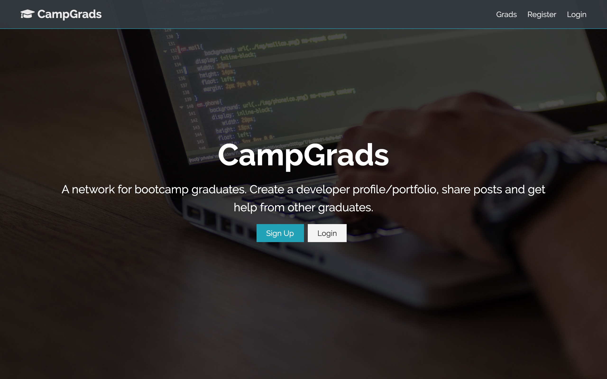

  
  
# Camp Grads

Social Networking site for coding bootcamp graduates. Users can create profiles, view other profiles, create posts and comment on other posts.

## Technology

This is a full-stack application which uses the MERN stack and a few other technologies:

- MongoDB
  - Hosted on Atlas
  - Uses Mongoose ODM
- Node/Express server
- React front end
- Redux for front end state management
- JWT and Bcrypt for user authentication
- Use Github and Gravatar API's

## Deployed Site

[https://campgrads.herokuapp.com](https://campgrads.herokuapp.com)

Please feel free to register or use the following credentials to login:

email: jon@jon.com

password: jonjon
